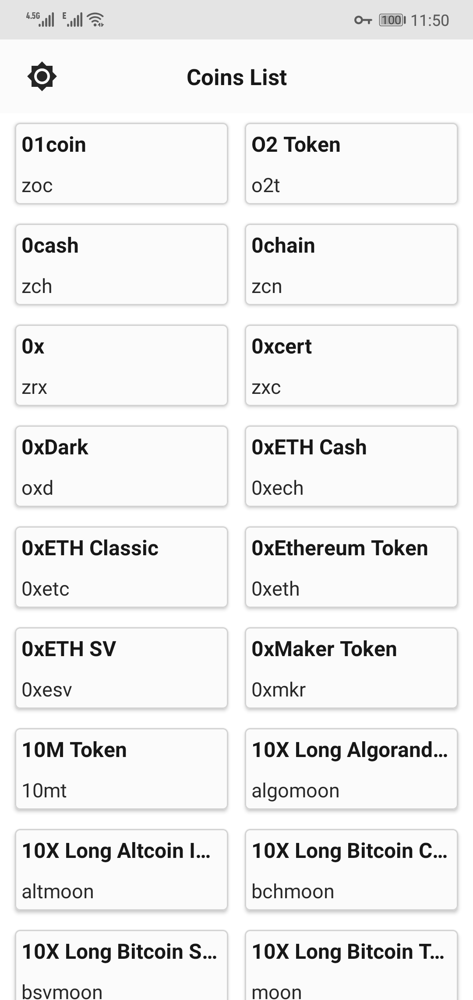

#### Android Clean Architecture Sample with MVP design pattern.
A Sample app for implementing Clean Architecture with MVP and Repository pattern using RxJava.
I Also developed an mvvm sample with kotlin and power of coroutines. In this mvp sample I used Java and RxJava.
It is a simple app, gets list of cryptocurrency coins from coingecko api, save to database and show to user.

### Features
* Java
* Clean Architecture: I have seen some people using a centralized data manager for data and model layer but I am not intrested in that approach because I think centralized approach is not modular freindly. 
* Repository Pattern with RxJava. 
* MVP Design Pattern: this design act on presentation layer.
* Android ViewBinding(different from databinding): instead of ButterKnife in classic MVPs, I used new android ViewBinding.
* RxJava for concurrency and stream and also networking.
* Okhttp and Retrofit for networking.
* Room For Data Persistence. 
* Dagger2 for DI.
* Navigation Component for fragments.
* Dark Mode and Material Theme. 
* I used CoinGecko Free Api for coins list. https://www.coingecko.com/en
